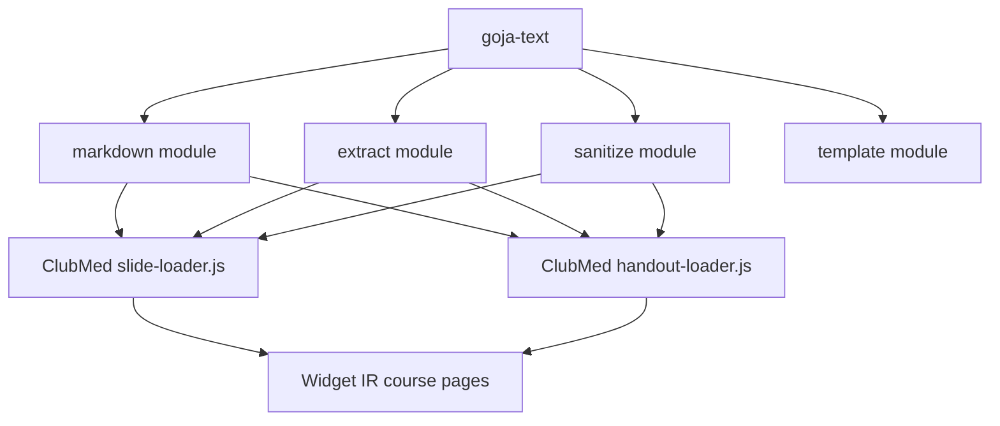
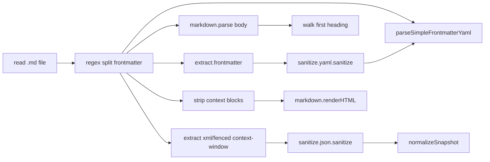
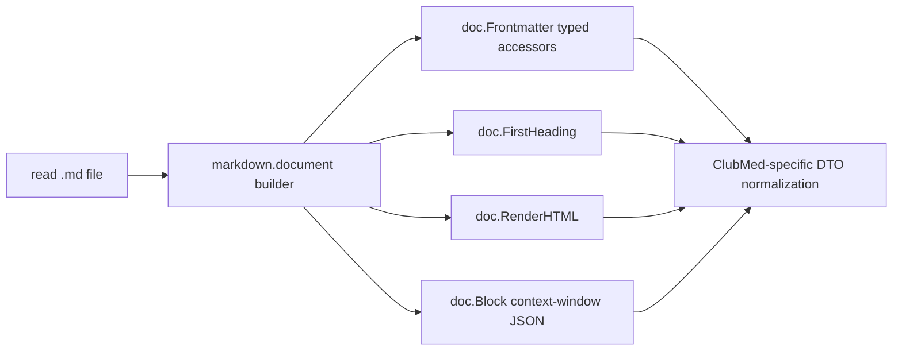
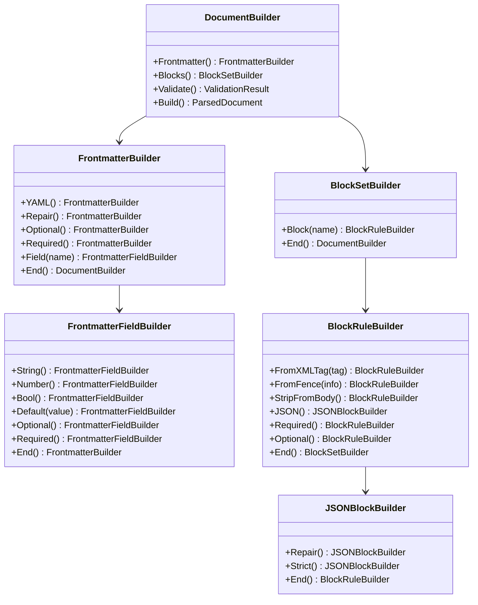
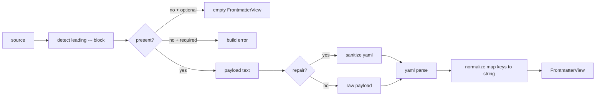

# Fluent Document Builder API Design and Implementation Guide

## Executive summary

This document proposes a design-first implementation plan for point 7 from the ClubMedMeetup xgoja/goja module improvement ticket: `goja-text` should offer document-level helpers. The target user is a new intern who needs enough context to understand the existing `goja-text` modules, why `ClubMedMeetup/minitrace-viz` currently duplicates parsing logic, and how to add a safe, elegant fluent API without weakening runtime invariants.

The key design choice is to build documents on the Go side with Go-backed builder objects, not JavaScript option maps. JavaScript should still compose the workflow fluently, but every important invariant should be encoded by Go methods, Go validation, and Go result objects. This follows existing `goja-text` patterns: `markdown.builder()`, `extract.options()`, `sanitize.yaml.options()`, and `template.text()` already expose fluent Go-backed objects into Goja.

The proposed new entrypoint is:

```js
const markdown = require("markdown");

const doc = markdown.document(source)
  .Frontmatter()
    .YAML()
    .Repair()
    .Optional()
    .Field("id").String().Optional().End()
    .Field("title").String().Optional().End()
    .Field("number").String().Optional().End()
    .End()
  .Blocks()
    .Block("context-window")
      .FromXMLTag("context-window")
      .FromFence("context-window")
      .JSON().Repair().Optional().End()
      .StripFromBody()
      .End()
    .End()
  .Build();

const fm = doc.Frontmatter();
const title = fm.String("title", doc.FirstHeading(baseName));
const html = doc.RenderHTML();
const snapshot = doc.Block("context-window").JSONValue();
```

This API keeps the authoring experience readable from JavaScript, but avoids a large fragile object such as `markdown.document(source, { frontmatter: true, sanitize: true, extractBlocks: [...] })`. That matters because the problem we are solving is not just convenience. The current application reimplements frontmatter splitting, scalar coercion, fallback title extraction, structured block extraction, JSON repair, and body stripping in multiple files. A reusable document builder should make that code smaller while also making invalid configurations fail early and consistently.

## Problem statement

`ClubMedMeetup/minitrace-viz` uses `goja-text` primitives today, but the application still owns too much document parsing policy in JavaScript. The duplicated code appears in:

- `ClubMedMeetup/minitrace-viz/lib/slide-loader.js`
- `ClubMedMeetup/minitrace-viz/lib/handout-loader.js`

Both loaders import the same three `goja-text` modules:

```js
const markdown = require("markdown");
const extract = require("extract");
const sanitize = require("sanitize");
```

They then implement overlapping helpers locally:

- `parseScalar(value)` for quoted strings, booleans, and numbers;
- `parseSimpleFrontmatterYaml(text)` for a restricted YAML subset;
- `splitFrontmatter(source)` using a regex plus `extract.frontmatter()` plus `sanitize.yaml.sanitize()`;
- `headingTitle()` / `firstHeading()` using `markdown.parse()`, `markdown.walk()`, and `markdown.textContent()` with regex fallback;
- context-window extraction in `slide-loader.js` using `extract.xmlTagged()` and `extract.markdownCodeBlocks()` with regex fallback;
- JSON repair in `slide-loader.js` using `sanitize.json.sanitize()`.

The current code is reasonable application code, but it is the wrong long-term home for these concerns. Frontmatter parsing and Markdown block extraction are reusable document-level operations. Leaving them in each application means every xgoja site will make slightly different choices about malformed YAML, scalar coercion, missing delimiters, body stripping, and HTML rendering.

The design goal is therefore:

> Add a `markdown.document()` fluent builder to `goja-text` that parses a Markdown document once, applies frontmatter and block extraction policies on the Go side, and exposes a Go-backed document view with helper methods for common application queries.

The secondary goal is:

> Refactor `ClubMedMeetup/minitrace-viz` after the helper is reviewed and implemented, so `slide-loader.js` and `handout-loader.js` stop duplicating parsing infrastructure and only keep ClubMed-specific normalization logic.

## Current system map

### Repository roles



`goja-text` is a Go module that registers native Goja modules with `go-go-goja`. The xgoja provider lives in `goja-text/pkg/xgoja/providers/text/text.go` and registers four modules: `markdown`, `sanitize`, `extract`, and `template`. The provider also ships help docs as a provider help source named `runtime-api`.

`ClubMedMeetup/minitrace-viz/xgoja.yaml` selects `goja-text` modules as xgoja modules:

```yaml
- package: goja-text
  name: markdown
  as: markdown
- package: goja-text
  name: sanitize
  as: sanitize
- package: goja-text
  name: extract
  as: extract
- package: goja-text
  name: template
  as: template
```

The application uses `markdown`, `sanitize`, and `extract`. It selects `template` but does not currently import it in `server.js` or `lib/*`.

### Existing `markdown` module

Relevant files:

- `goja-text/pkg/markdown/module.go`
- `goja-text/pkg/markdown/parser.go`
- `goja-text/pkg/markdown/convert.go`
- `goja-text/pkg/markdown/types.go`
- `goja-text/pkg/markdown/builder.go`
- `goja-text/pkg/markdown/builder_render.go`
- `goja-text/pkg/markdown/module_test.go`

The current `markdown` module exposes:

```js
const markdown = require("markdown");

const ast = markdown.parse("# Hello");
const html = markdown.renderHTML("# Hello");
markdown.walk(ast, (node, ctx) => { /* ... */ });
const text = markdown.textContent(ast.Children[0]);
const result = markdown.validate(ast);
const builder = markdown.builder();
const inline = markdown.inline();
```

Important current design pattern: parsed nodes are Go-backed `MarkdownNode` values. JavaScript sees exported Go field names such as `node.Type`, `node.Children`, `node.Level`, `node.Text`, and `node.SourcePos`. This is not lower-camel JSON. It is an intentional Go-backed runtime projection.

The builder path is also Go-backed:

```js
const result = markdown.builder()
  .Title("Sprint report")
  .Paragraph("Generated from JS data.")
  .Table()
    .Columns({ label: "Name", align: "left" }, { label: "Status", align: "right" })
    .Row("Parser", "done")
    .End()
  .Render();
```

`MarkdownBuilder` accumulates errors in Go, validates table widths and heading levels in Go, and only renders after validation passes. The proposed document builder should copy this pattern.

### Existing `extract` module

Relevant files:

- `goja-text/pkg/extract/module.go`
- `goja-text/pkg/extract/frontmatter.go`
- `goja-text/pkg/extract/markdown_fences.go`
- `goja-text/pkg/extract/xml_tags.go`
- `goja-text/pkg/extract/types.go`

The current `extract` module returns candidates rather than trusted parsed values:

```js
const candidates = extract.frontmatter(source);
const blocks = extract.markdownCodeBlocks(body);
const tags = extract.xmlTagged(body);
```

An `ExtractionCandidate` contains payload text, raw wrapper text, source positions, format, wrapper, confidence, and diagnostics. That is a good primitive API. The proposed document helper should not replace `extract`; it should compose it for a common document workflow.

### Existing `sanitize` module

Relevant files:

- `goja-text/pkg/sanitize/module.go`
- `goja-text/pkg/sanitize/options.go`
- `goja-text/pkg/sanitize/types.go`

The current `sanitize` module exposes builder-backed options and Go-backed result objects:

```js
const repairedYaml = sanitize.yaml.sanitize(frontmatterText);
const repairedJson = sanitize.json.sanitize(candidateText);
```

The document builder should be able to opt into repair as part of a frontmatter or structured-block rule. The application should not have to manually call `sanitize.yaml.sanitize()` every time it wants forgiving frontmatter.

### Existing ClubMed loaders

`slide-loader.js` currently does all of this:



`handout-loader.js` has the same frontmatter and first-heading pattern, but without context-window extraction.

The refactoring target is to turn the common part into:



## Proposed API contract

### Design principles

1. **Builder methods over option maps.** JavaScript should configure parsing through fluent Go-backed methods. Avoid `markdown.document(source, optionsObject)` for the primary API.
2. **Go owns invariants.** Invalid block labels, unsupported frontmatter formats, missing required fields, impossible parse policies, and invalid JSON repair settings should be recorded and reported by Go validation.
3. **The built document is a Go-backed view.** JavaScript should call methods like `doc.Frontmatter().String(...)` and `doc.Block(...).JSONValue()` rather than depending on a loosely-shaped object tree.
4. **Keep primitives available.** `markdown.parse`, `extract.frontmatter`, and `sanitize.json.sanitize` remain useful lower-level APIs. `markdown.document()` is a convenience layer, not a replacement.
5. **Make the common path short.** The ClubMed slide/handout cases should be materially simpler after migration.
6. **Fail predictably.** A builder should support both `Validate()` and `Build()`. `Build()` should return an error with all accumulated validation errors.
7. **Avoid domain-specific naming in goja-text.** The module can handle a block named `context-window`, but it should not know what a ClubMed context window snapshot means.

### Top-level module export

Add one function to `markdown`:

```ts
export function document(source: string): DocumentBuilder;
```

In Go, this is registered in `goja-text/pkg/markdown/module.go`:

```go
modules.SetExport(exports, mod.Name(), "document", func(source string) *DocumentBuilder {
    return NewDocumentBuilder(source)
})
```

### Fluent builder shape

The primary JS shape should be:

```js
const doc = markdown.document(source)
  .Frontmatter()
    .YAML()
    .Repair()
    .Optional()
    .Field("id").String().Optional().End()
    .Field("title").String().Optional().End()
    .Field("number").String().Optional().End()
    .End()
  .Blocks()
    .Block("context-window")
      .FromXMLTag("context-window")
      .FromFence("context-window")
      .JSON().Repair().Optional().End()
      .StripFromBody()
      .End()
    .End()
  .Build();
```

The indentation shows parent/child builder ownership:



This looks like more code than a JS map, but it has three advantages:

- the public API is discoverable by method names;
- goja exposes real Go objects, so invalid configurations can be stored and reported consistently;
- the same validation can be reused by Go tests, JS integration tests, and xgoja applications.

### Parsed document shape

`Build()` returns a `*ParsedDocument` Go object exposed into JavaScript. It should not primarily expose public mutable fields. Prefer methods:

```ts
interface ParsedDocument {
  Body(): string;
  AST(): MarkdownNode;
  FirstHeading(fallback?: string): string;
  RenderHTML(): string;
  Frontmatter(): FrontmatterView;
  Blocks(): DocumentBlockCollection;
  Block(name: string): DocumentBlock;
}
```

`FrontmatterView` should replace application-level scalar parsing:

```ts
interface FrontmatterView {
  Has(name: string): boolean;
  Value(name: string): unknown;
  String(name: string, fallback?: string): string;
  Number(name: string, fallback?: number): number;
  Bool(name: string, fallback?: boolean): boolean;
  Keys(): string[];
  ToObject(): Record<string, unknown>; // Escape hatch only.
}
```

`DocumentBlock` should support both raw access and parsed access:

```ts
interface DocumentBlock {
  Name(): string;
  Kind(): "xml" | "fence";
  Text(): string;
  Raw(): string;
  StartByte(): number;
  EndByte(): number;
  JSONValue(): unknown;
  JSONString(path: string, fallback?: string): string; // optional later phase
}
```

The initial version can keep `JSONValue()` generic. A later version can add fluent JSON path validators if real users need typed nested accessors.

### Minimal API for first implementation

The full nested field schema is elegant, but it may be too much for the first implementation. A good first slice that still honors the user's builder requirement is:

```js
const doc = markdown.document(source)
  .Frontmatter().YAML().Repair().Optional().End()
  .Blocks()
    .Block("context-window")
      .FromXMLTag("context-window")
      .FromFence("context-window")
      .JSON().Repair().Optional().End()
      .StripFromBody()
      .End()
    .End()
  .Build();

const fm = doc.Frontmatter();
const id = fm.String("id", baseName);
const title = fm.String("title", doc.FirstHeading(baseName));
```

This first slice removes the major duplication from ClubMed while leaving field declaration builders for a second iteration.

## Go package design

### New files

Add these files under `goja-text/pkg/markdown`:

| File | Responsibility |
| --- | --- |
| `document_builder.go` | `DocumentBuilder`, nested config builders, validation, build orchestration. |
| `document_frontmatter.go` | Frontmatter extraction, repair, YAML parse, typed `FrontmatterView` accessors. |
| `document_blocks.go` | Block rule config, XML/fenced block extraction, strip-from-body logic. |
| `document_types.go` | Result types: `ParsedDocument`, `DocumentBlock`, validation/result structs. |
| `document_test.go` | Pure Go tests for parsing, validation, frontmatter, block extraction, stripping. |
| `document_module_test.go` | Goja integration tests for `require("markdown").document(...)`. |

Keep the new API in the `markdown` package rather than creating a new `document` module. The feature is conceptually Markdown document parsing and should sit next to `parse`, `renderHTML`, `walk`, and `builder`.

### Core Go structs

Pseudocode:

```go
type DocumentBuilder struct {
    source string
    frontmatter *FrontmatterConfig
    blocks []BlockRule
    errors []string
}

type FrontmatterConfig struct {
    enabled bool
    format string // initially only "yaml"
    repair bool
    required bool
    fields []FrontmatterFieldRule // optional first-slice feature
}

type BlockRule struct {
    name string
    sources []BlockSourceRule // xml tag, fenced block info string
    stripFromBody bool
    required bool
    json *JSONBlockConfig
}

type JSONBlockConfig struct {
    enabled bool
    repair bool
    strict bool
}

type ParsedDocument struct {
    source string
    body string
    ast *MarkdownNode
    frontmatter *FrontmatterView
    blocks []*DocumentBlock
}
```

Nested builders should hold pointers to their parent config and parent builder. Example:

```go
type FrontmatterBuilder struct {
    parent *DocumentBuilder
    cfg *FrontmatterConfig
}

func (b *DocumentBuilder) Frontmatter() *FrontmatterBuilder {
    if b.frontmatter == nil {
        b.frontmatter = &FrontmatterConfig{enabled: true, format: "yaml"}
    }
    return &FrontmatterBuilder{parent: b, cfg: b.frontmatter}
}

func (fb *FrontmatterBuilder) YAML() *FrontmatterBuilder {
    fb.cfg.format = "yaml"
    return fb
}

func (fb *FrontmatterBuilder) Repair() *FrontmatterBuilder {
    fb.cfg.repair = true
    return fb
}

func (fb *FrontmatterBuilder) End() *DocumentBuilder {
    return fb.parent
}
```

This is the same parent-return pattern used by `MarkdownBuilder.Table().End()`.

### Validation rules

`DocumentBuilder.Validate()` should aggregate every configuration error instead of failing on the first one.

Recommended initial rules:

- frontmatter format must be empty or `yaml`;
- a required frontmatter section must exist;
- block rule names must match `^[a-z0-9][a-z0-9_-]*$` after normalization;
- XML tag names must be valid XML-ish simple names;
- fenced block info labels must be non-empty and must not contain whitespace in the simple first-slice API;
- a required block must be present in the document;
- `JSON().Strict()` and `JSON().Repair()` can coexist only if semantics are clear; recommended first behavior: `Strict()` disables repair and validates exact JSON;
- duplicate block names should be rejected unless the API explicitly supports multiple blocks under the same name.

Runtime parse errors should include API context:

```text
markdown.document.build: frontmatter: parse yaml: line 2: did not find expected key
markdown.document.build: block "context-window": json: invalid character '}' looking for beginning of object key string
markdown.document.build: invalid config: block name "context window" must match ^[a-z0-9][a-z0-9_-]*$
```

### Frontmatter implementation

For frontmatter extraction, reuse the existing behavior from `extract.Frontmatter` where possible, or implement an internal exact splitter if importing the sibling package would create an undesirable package cycle. There is no cycle if `markdown` imports `extract` today? Check first before implementing. If a cycle appears, prefer moving shared frontmatter scanning into a small internal package rather than duplicating long-term.

Frontmatter processing pipeline:



Use `gopkg.in/yaml.v3`, already present in the workspace dependency graph, or a dependency already used by the repo. The result should be normalized so Goja receives predictable maps if callers use the escape hatch.

Typed accessor behavior:

```go
func (v *FrontmatterView) String(name string, fallback ...string) string
func (v *FrontmatterView) Number(name string, fallback ...float64) float64
func (v *FrontmatterView) Bool(name string, fallback ...bool) bool
```

Coercion policy should be documented:

- existing string returns itself;
- numeric values convert to decimal strings for `String`;
- booleans convert to `true` / `false` for `String`;
- quoted YAML strings are already unquoted by YAML parsing;
- invalid conversion returns fallback if supplied, otherwise zero value;
- strict field schema can be added later if invalid conversion should fail build.

### Block extraction implementation

The first implementation should support the two ClubMed `context-window` syntaxes:

```md
<context-window>
{ "id": "demo" }
</context-window>
```

and:

````md
```context-window
{ "id": "demo" }
```
````

The block rule builder can support both:

```js
.Block("context-window")
  .FromXMLTag("context-window")
  .FromFence("context-window")
  .JSON().Repair().Optional().End()
  .StripFromBody()
  .End()
```

Extraction should store:

- block name configured by the rule;
- source kind: `xml` or `fence`;
- payload text;
- raw wrapper text;
- byte offsets in the document body before stripping;
- parsed JSON value if configured;
- diagnostics/fixes if repair occurred, if easily available from `sanitize` result.

Body stripping should happen after extraction and before Markdown AST parsing/HTML rendering. This mirrors current `slide-loader.js`, which does not want the `context-window` payload rendered into slide HTML.

### Rendering behavior

`ParsedDocument.RenderHTML()` should call existing `RenderHTML(d.body)`. This is intentionally boring. Do not fork rendering behavior for document helpers.

`ParsedDocument.FirstHeading(fallback ...string)` should parse from the stripped body AST, not the original source, because hidden structured blocks should not influence user-visible titles.

### Module registration and TypeScript declarations

Update `goja-text/pkg/markdown/module.go`:

- add `document` to `Doc()`;
- add the `document` export in `Loader`;
- extend `TypeScriptModule()` RawDTS with `DocumentBuilder`, nested builders, `ParsedDocument`, `FrontmatterView`, `DocumentBlock`, and `DocumentValidationResult`.

Minimal TypeScript surface for first slice:

```ts
export function document(source: string): DocumentBuilder;

export interface DocumentBuilder {
  Frontmatter(): FrontmatterBuilder;
  Blocks(): BlockSetBuilder;
  Validate(): ValidationResult;
  Build(): ParsedDocument;
}

export interface FrontmatterBuilder {
  YAML(): FrontmatterBuilder;
  Repair(): FrontmatterBuilder;
  Optional(): FrontmatterBuilder;
  Required(): FrontmatterBuilder;
  End(): DocumentBuilder;
}

export interface BlockSetBuilder {
  Block(name: string): BlockRuleBuilder;
  End(): DocumentBuilder;
}

export interface BlockRuleBuilder {
  FromXMLTag(tag: string): BlockRuleBuilder;
  FromFence(info: string): BlockRuleBuilder;
  StripFromBody(): BlockRuleBuilder;
  JSON(): JSONBlockBuilder;
  Optional(): BlockRuleBuilder;
  Required(): BlockRuleBuilder;
  End(): BlockSetBuilder;
}

export interface JSONBlockBuilder {
  Repair(): JSONBlockBuilder;
  Strict(): JSONBlockBuilder;
  End(): BlockRuleBuilder;
}

export interface ParsedDocument {
  Body(): string;
  AST(): MarkdownNode;
  FirstHeading(fallback?: string): string;
  RenderHTML(): string;
  Frontmatter(): FrontmatterView;
  Block(name: string): DocumentBlock | null;
}
```

## ClubMed migration guide

Do not refactor `ClubMedMeetup/minitrace-viz` until `goja-text` has the reviewed API and integration tests. After that, the migration should be small and mechanical.

### `slide-loader.js` before

Current local helpers to remove or shrink:

- `parseScalar`
- `parseSimpleFrontmatterYaml`
- `splitFrontmatter`
- `headingTitle`
- `stripContextBlocks`
- most of `parseJsonCandidate`
- most of `contextWindowCandidates`

Keep ClubMed-specific helpers:

- `safeString`
- `fileExists`
- `readSlideFiles`
- `bulletNotes`
- `normalizeSnapshot`
- slide navigation functions

### `slide-loader.js` after

Pseudocode:

```js
function parseSlideDocument(source, filePath) {
  return markdown.document(source)
    .Frontmatter()
      .YAML()
      .Repair()
      .Optional()
      .End()
    .Blocks()
      .Block("context-window")
        .FromXMLTag("context-window")
        .FromFence("context-window")
        .JSON().Repair().Optional().End()
        .StripFromBody()
        .End()
      .End()
    .Build();
}

function loadSlideFile(filePath, index) {
  const source = fs.readFileSync(filePath, "utf8");
  const doc = parseSlideDocument(source, filePath);
  const fm = doc.Frontmatter();

  const baseName = path.basename(filePath, ".md").replace(/^\d+-/, "");
  const slideId = safeString(fm.String("id", baseName), baseName);
  const title = safeString(fm.String("title", doc.FirstHeading(baseName)), baseName);
  const block = doc.Block("context-window");
  const snapshotValue = block ? block.JSONValue() : null;
  const snapshot = normalizeSnapshot(snapshotValue, slideId);

  return {
    id: slideId,
    file: filePath,
    index,
    total: 0,
    slide: {
      id: slideId,
      number: safeString(fm.String("number", String(index + 1).padStart(2, "0"))),
      kicker: safeString(fm.String("kicker", "MODULE")),
      title,
      view: safeString(fm.String("view", "budget")),
      snapshotId: snapshot.id,
      notes: bulletNotes(doc.Body()).length ? bulletNotes(doc.Body()) : ["This Markdown slide does not define bullet notes yet."],
    },
    snapshot,
    visualSide: safeString(fm.String("visualSide", index % 2 === 0 ? "right" : "left")),
    html: doc.RenderHTML(),
    markdown: doc.Body(),
  };
}
```

This keeps application-specific DTO shaping in JavaScript but removes parser policy.

### `handout-loader.js` after

Pseudocode:

```js
function loadHandoutFile(filePath) {
  const source = fs.readFileSync(filePath, "utf8");
  const doc = markdown.document(source)
    .Frontmatter().YAML().Repair().Optional().End()
    .Build();
  const fm = doc.Frontmatter();

  const fileName = path.basename(filePath);
  const baseName = path.basename(filePath, ".md").replace(/^\d+-/, "");
  const id = safeString(fm.String("id", baseName));
  const title = safeString(fm.String("title", doc.FirstHeading(baseName)));
  const description = safeString(fm.String("description", firstParagraphExcerpt(doc.Body())));

  return {
    id,
    title,
    file: fileName,
    format: safeString(fm.String("format", "markdown")),
    size: humanBytes(source.length),
    description,
    body: doc.Body().trim(),
    sourcePath: filePath,
  };
}
```

The handout loader still needs `firstParagraphExcerpt`, because that is a site presentation policy rather than a generic Markdown document invariant.

## Implementation plan for an intern

### Phase 0: Confirm the design and create failing tests first

Do not start with production code. Start with tests that describe the intended API.

Add `goja-text/pkg/markdown/document_module_test.go`:

```go
func TestRequireMarkdownDocumentParsesFrontmatterAndHeading(t *testing.T) {
    rt := newMarkdownRuntime(t)
    ret, err := rt.Owner.Call(context.Background(), "markdown.document.frontmatter", func(_ context.Context, vm *goja.Runtime) (any, error) {
        value, runErr := vm.RunString(`
            const markdown = require("markdown");
            const doc = markdown.document(` + "`" + `---
title: Demo
number: "01"
---
# Heading

Body.` + "`" + `)
              .Frontmatter().YAML().Repair().Optional().End()
              .Build();
            ({
              title: doc.Frontmatter().String("title", "fallback"),
              number: doc.Frontmatter().String("number", "00"),
              heading: doc.FirstHeading("fallback"),
              html: doc.RenderHTML(),
            });
        `)
        if runErr != nil { return nil, runErr }
        return value.Export(), nil
    })
    // assert title, number, heading, html
}
```

Add a block extraction test:

```go
func TestRequireMarkdownDocumentExtractsAndStripsJSONBlock(t *testing.T) {
    // JS should configure XML + fence extraction, Build(), then assert:
    // - doc.Body() no longer contains context-window
    // - doc.RenderHTML() no longer renders JSON payload
    // - doc.Block("context-window").JSONValue().id == "demo"
}
```

Add validation tests:

```go
func TestRequireMarkdownDocumentRejectsInvalidBlockName(t *testing.T) {
    // markdown.document("# x").Blocks().Block("context window").End().End().Build()
    // should throw an error containing invalid block name.
}
```

### Phase 1: Add builder/result types without wiring the module export

Create the new files and implement pure Go methods first. Run:

```bash
cd goja-text
go test ./pkg/markdown -count=1
```

At this stage, tests can directly call `NewDocumentBuilder(source)` from Go.

### Phase 2: Wire `markdown.document()` into the Goja module

Update `module.go`:

```go
modules.SetExport(exports, mod.Name(), "document", func(source string) *DocumentBuilder {
    return NewDocumentBuilder(source)
})
```

Update `Doc()` and `TypeScriptModule()`.

Run:

```bash
cd goja-text
go test ./pkg/markdown -count=1
go test ./... -count=1
```

### Phase 3: Add help docs and examples

Update provider help pages under the text provider docs so users discover the new API from generated xgoja help. Add a runnable example script, for example:

- `examples/js/markdown-document-demo.js`
- optional jsverb under `cmd/goja-text/jsverbs/markdown.js`, such as `markdown documentSummary`.

Validation:

```bash
cd goja-text
make build-xgoja
./dist/goja-text help goja-text-markdown-api-reference
./dist/goja-text run examples/js/markdown-document-demo.js
```

### Phase 4: Refactor ClubMed slide loader

Only after goja-text tests pass, change `ClubMedMeetup/minitrace-viz/lib/slide-loader.js`.

Validation from the app directory:

```bash
cd ClubMedMeetup/minitrace-viz
xgoja build -f xgoja.yaml --xgoja-version v0.8.4
./dist/minitrace-viz eval --http-enabled=false 'const slides = require("./lib/slide-loader").loadSlideDeck(); JSON.stringify({ count: slides.length, first: slides[0] && slides[0].id })'
```

Then run existing smoke tests or the updated Widget API smoke test if available.

### Phase 5: Refactor ClubMed handout loader

Change `ClubMedMeetup/minitrace-viz/lib/handout-loader.js` after slide-loader proves the API. Handout parsing is simpler and should be a good second migration.

Validation:

```bash
./dist/minitrace-viz eval --http-enabled=false 'const h = require("./lib/handout-loader").loadHandoutBundle(); JSON.stringify({ count: h.docs.length, first: h.docs[0] && h.docs[0].id })'
```

### Phase 6: Full validation

Run both repos:

```bash
cd goja-text
go test ./... -count=1
GOWORK=off go test ./... -count=1
make check

cd ../ClubMedMeetup/minitrace-viz
GOWORK=off go test ./... -count=1
xgoja doctor -f xgoja.yaml
xgoja build -f xgoja.yaml --xgoja-version v0.8.4
./dist/minitrace-viz run server.js --http-listen 127.0.0.1:18787 --keep-alive
```

For the running app, smoke at least:

```bash
curl -fsS http://127.0.0.1:18787/api/widget/health
curl -fsS http://127.0.0.1:18787/api/widget/pages/index
```

## Testing strategy

### Unit tests in `goja-text/pkg/markdown`

Test these cases:

- no frontmatter with optional config returns empty `FrontmatterView`;
- no frontmatter with required config returns a build error;
- valid YAML frontmatter produces typed accessors;
- malformed YAML with `.Repair()` is repaired or returns a contextual error if unrecoverable;
- first heading uses Markdown AST, not regex fallback;
- XML `context-window` block is extracted;
- fenced `context-window` block is extracted;
- `.StripFromBody()` removes configured blocks before `RenderHTML()`;
- invalid block names fail `Validate()` and `Build()`;
- duplicate block rule names fail or have documented behavior.

### Goja integration tests

Test from JavaScript, not just Go:

- fluent chaining returns the correct parent builder at every `.End()`;
- `Build()` throws Go errors as JavaScript exceptions when invalid;
- `doc.Frontmatter().String(...)` works from JS;
- `doc.Block("context-window").JSONValue()` exports a JS-usable object;
- existing `markdown.parse`, `renderHTML`, `walk`, `builder`, and `inline` tests still pass.

### ClubMed regression tests

Add a fixture-based test or eval script that loads actual course Markdown:

- slide count unchanged;
- first slide ID/title unchanged;
- handout count unchanged;
- context-window snapshot still normalizes into expected shape;
- rendered slide HTML does not contain raw `context-window` JSON.

## Decision records

### DR-1: Use Go-backed fluent builders instead of JavaScript option maps

**Context:** The user explicitly asked for an elegant fluent builder API where building is done on the Go side to enforce solid invariants at runtime.

**Options considered:**

1. `markdown.document(source, { frontmatter: true, sanitize: true, extractBlocks: [...] })`.
2. A set of one-off helpers such as `markdown.frontmatter(source)` and `markdown.stripBlocks(source)`.
3. A Go-backed fluent builder with nested configuration builders.

**Decision:** Use a Go-backed fluent builder exposed from `markdown.document(source)`.

**Rationale:** This matches existing `goja-text` style, keeps configuration discoverable, allows validation before parsing, and avoids scattering policy across loose JS objects.

**Consequences:** The Go implementation is larger than an options-map helper, and TypeScript declarations must document nested builders carefully. In exchange, runtime failures are clearer and application code shrinks.

**Status:** Proposed.

### DR-2: Keep the API in the `markdown` module

**Context:** Document parsing uses Markdown body parsing, frontmatter, structured block extraction, and HTML rendering. It could be its own module or part of `markdown`.

**Options considered:**

1. New `document` module.
2. New `markdown.document()` export.
3. Higher-level helper in `extract`.

**Decision:** Add `markdown.document()`.

**Rationale:** The built object is fundamentally a Markdown document view. The caller already imports `markdown` for parsing headings and rendering HTML. Keeping the API there avoids another xgoja module alias.

**Consequences:** The `markdown` package may need to depend on or share code with extraction/sanitization primitives. Avoid package cycles during implementation.

**Status:** Proposed.

### DR-3: Result objects expose methods, not only exported fields

**Context:** Existing `MarkdownNode` exposes public fields. For a higher-level document view, mutable public fields would weaken invariants.

**Options considered:**

1. Public fields like `doc.Frontmatter`, `doc.Body`, `doc.Blocks`.
2. Methods like `doc.Frontmatter()`, `doc.Body()`, `doc.Block(name)`.
3. Plain JS object snapshot returned by `Build()`.

**Decision:** Prefer Go-backed methods for `ParsedDocument`, `FrontmatterView`, and `DocumentBlock`, with escape hatches such as `ToObject()` only where necessary.

**Rationale:** Methods let Go maintain normalization and conversion behavior. They also make future validation additions possible without breaking every caller.

**Consequences:** JavaScript code is slightly more verbose but more explicit.

**Status:** Proposed.

## Risks and review checklist

### Risks

- **Package cycles:** `markdown` may want to reuse `extract` and `sanitize`, but imports must not create cycles.
- **Over-designed first version:** Nested field schema builders are powerful but may delay the core ClubMed cleanup. Implement the minimal first slice first.
- **Goja method naming:** Go-backed methods are PascalCase. This is consistent with existing builders but must be documented for JS users.
- **Generic JSON values:** `JSONValue()` necessarily returns dynamic data. Do not claim it enforces domain-level invariants unless a schema/field builder is added.
- **Behavior drift:** Refactoring ClubMed loaders could subtly change frontmatter scalar coercion or title fallback behavior. Add fixture regression tests.

### API review checklist

Before implementation, review these questions:

- Is the nested `.Frontmatter().YAML().Repair().Optional().End()` shape acceptable, or should the first version use shorter direct methods like `.YAMLFrontmatter().RepairFrontmatter()`?
- Should first-slice `FrontmatterView.String()` silently coerce numbers/bools, or should coercion only happen when fields are declared?
- Should duplicate block names be rejected, or should `doc.Blocks("name")` return all matches?
- Should `.JSON().Repair().Optional()` store repair diagnostics and expose them?
- Should the first ClubMed migration require field declarations, or is typed accessor fallback enough?

## References

Primary source files:

- `goja-text/pkg/markdown/module.go` — current module export and TypeScript declaration surface.
- `goja-text/pkg/markdown/builder.go` — existing Go-backed fluent builder pattern.
- `goja-text/pkg/markdown/parser.go` — current Markdown parse/render primitives.
- `goja-text/pkg/markdown/convert.go` — Go-backed `MarkdownNode` conversion and text extraction.
- `goja-text/pkg/extract/frontmatter.go` — current frontmatter extraction primitive.
- `goja-text/pkg/extract/markdown_fences.go` — current fenced code block extraction primitive.
- `goja-text/pkg/extract/xml_tags.go` — current XML-like block extraction primitive.
- `goja-text/pkg/sanitize/module.go` — current YAML/JSON repair module.
- `goja-text/pkg/xgoja/providers/text/text.go` — xgoja provider registration and help source.
- `ClubMedMeetup/minitrace-viz/lib/slide-loader.js` — main target for context-window/frontmatter refactor.
- `ClubMedMeetup/minitrace-viz/lib/handout-loader.js` — second target for frontmatter/heading refactor.
- `ClubMedMeetup/minitrace-viz/xgoja.yaml` — module aliases showing how `markdown`, `extract`, and `sanitize` are selected.

Related design source:

- `ClubMedMeetup/ttmp/2026/06/08/xgoja-modules-improvement-second-edition--improve-xgoja-and-goja-modules-from-clubmedmeetup-usage-patterns-second-edition/design-doc/01-xgoja-and-goja-module-improvement-map-second-edition.md` — source ticket that identifies point 7: document-level helpers for `goja-text`.
