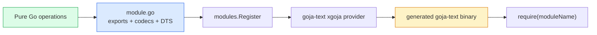
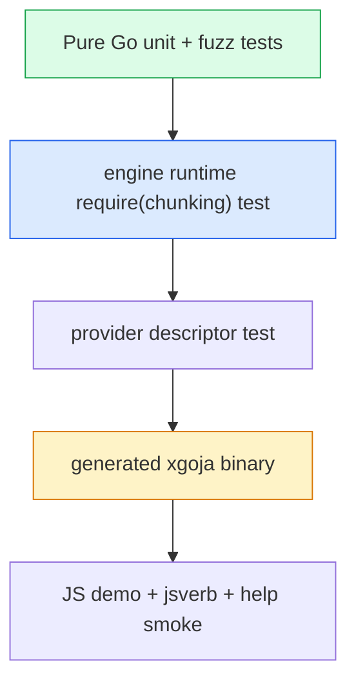

# Source-Preserving Chunking Architecture and Implementation Guide

## Executive Summary

This ticket adds a `chunking` native module to `goja-text`. The module turns UTF-8 source text into exact, inspectable spans and then packs those spans into bounded chunks. It supports plain-text boundaries and Markdown structure without adding transcript, embedding, vector-search, or retrieval-specific behavior.

The central correctness property is **source preservation**. A built-in segmenter must partition the original source byte for byte. A packer may repeat complete spans only through an explicit overlap policy; it must never silently drop source text, invent citation ranges, or reconstruct Markdown from plain text.

The implementation has four layers:

1. Extend Markdown AST nodes with exact byte/rune/end coordinates.
2. Add pure-Go segmenting and packing algorithms in `pkg/chunking`.
3. Expose those algorithms through `require("chunking")` with TypeScript declarations.
4. Package the module, examples, jsverbs, and help pages into the generated xgoja binary.

The work implements [GitHub issue #9](https://github.com/go-go-golems/goja-text/issues/9). This document is self-contained: a new engineer should be able to implement, review, or extend the feature without reconstructing its design from the issue discussion.

## Problem Statement

### Why fixed windows are insufficient

A fixed rune window is deterministic and Unicode-safe, but it ignores document structure. It may split:

- a heading from the paragraph it introduces;
- a list halfway through an item;
- a fenced code block between its opening fence and body;
- a block quote in the middle of a statement;
- a Markdown section immediately before a decisive sentence.

Downstream systems can still embed such chunks, but citations and retrieval quality become harder to reason about. The text library already parses Markdown through Goldmark, so it should expose reusable structural boundaries rather than forcing each application to reverse-engineer the AST.

### Why source coordinates are part of the API

Chunking is not only a text-generation operation. Consumers need to relate a chunk back to the original document. That requires two coordinate systems:

- byte offsets for exact UTF-8 slices, storage, and transport;
- rune offsets for Unicode-aware character budgets and user-facing lengths.

JavaScript string indices are UTF-16 code units, so they cannot substitute for either coordinate system. Offsets must be computed in Go against the original UTF-8 source and returned as explicit fields.

### Scope

In scope:

- exact Markdown AST source ranges;
- line, paragraph, Markdown-block, and Markdown-section segmenters;
- byte, rune, word, and caller-provided weight budgets;
- whole-span overlap;
- explicit oversized-span policy;
- recursive fallback splitting;
- strategy descriptions and diagnostics;
- JavaScript, TypeScript, provider, generated-host, examples, and help integration.

Out of scope:

- transcript turn grouping;
- content hashes and application chunk IDs;
- embedding and tokenizer providers;
- semantic-breakpoint selection;
- vector indexes and retrieval fusion;
- generation manifests and evaluation metrics.

Those remain downstream responsibilities.

## Current-State Architecture

### Native modules

`goja-text` currently registers four Go-backed modules: `markdown`, `sanitize`, `extract`, and `template`. Each package contains domain logic and a small `module.go` adapter implementing:

```go
type NativeModule interface {
    Name() string
    Doc() string
    Loader(*goja.Runtime, *goja.Object)
}
```

Module packages register themselves through `modules.Register` during `init()`. The xgoja provider blank-imports every package, looks up the registered module by name, forwards its loader, and forwards its TypeScript descriptor.



Evidence:

- `pkg/markdown/module.go` implements both `NativeModule` and `TypeScriptDeclarer`.
- `pkg/xgoja/providers/text/text.go` enumerates provider module names and imports all native packages.
- `pkg/xgoja/providers/text/text_test.go` verifies that every provider module has a TypeScript descriptor.
- `cmd/goja-text/xgoja.yaml` selects the provider modules, embedded jsverbs, assets, and help source.

### Markdown representation

`markdown.parse(input)` returns a Go-backed `MarkdownNode`. JavaScript intentionally reads PascalCase Go fields:

```javascript
const markdown = require("markdown");
const ast = markdown.parse("# Title\n\nBody");

console.log(ast.Type);
console.log(ast.Children[0].Level);
```

The current node includes `StartLine`, `StartColumn`, and `SourcePos`, but not exact byte/rune end ranges. `ConvertAST` derives content fields through a type switch and recursively converts child nodes.

Goldmark source storage differs by node:

- inline text exposes a direct segment;
- block nodes expose one or more line segments;
- container nodes may need child aggregation;
- fenced code separates fence syntax from body-line values;
- HTML blocks may include a closure line;
- structural nodes such as thematic breaks may have no child text but still occupy source bytes.

The implementation must centralize these cases in one helper.

### Generated application

The committed generated application under `cmd/goja-text` is part of the product:

```text
cmd/goja-text/
├── xgoja.yaml
├── generate.go
├── main.go
├── jsverbs/
├── xgoja_embed/
├── go.mod
└── go.sum
```

Changes to provider modules or jsverbs require regeneration and a build. Runtime help is embedded from `pkg/xgoja/providers/text/doc/*.md`.

## Gap Analysis

| Required capability | Current support | Gap |
| --- | --- | --- |
| Exact Markdown start coordinate | Start line/column | No start byte/rune fields |
| Exact Markdown end coordinate | None | No end byte/rune/line/column |
| Line segmentation | Application code only | No native lossless primitive |
| Paragraph segmentation | None | Separator ownership undefined |
| Markdown block segmentation | AST can be walked | Callers must reconstruct ranges |
| Markdown section segmentation | Headings are exposed | No heading-path or section ranges |
| Budgeted packing | None | No shared budget/overlap invariants |
| Token-aware packing | None | Must avoid hard tokenizer dependency |
| Recursive fallback | None | Oversized structures have no policy |
| Strategy identity | None | Downstream plans cannot describe behavior |
| Diagnostics | Module errors only | No per-result warning/error evidence |
| Generated host | Four modules | `chunking` not registered or documented |

## Proposed Solution

### Coordinate semantics

All byte and rune offsets are zero-based and half-open:

```text
[StartByte, EndByte)
[StartRune, EndRune)
```

Line and column coordinates are one-based to remain consistent with the current Markdown API. End coordinates point immediately after the range.

Chunking entry points reject invalid UTF-8. Existing `markdown.parse` behavior is not changed.

### Public domain types

```go
type Span struct {
    Ordinal int
    Kind    string
    Text    string

    StartByte int
    EndByte   int
    StartRune int
    EndRune   int

    StartLine   int
    StartColumn int
    EndLine     int
    EndColumn   int

    Atomic       bool
    HeadingLevel int
    HeadingPath  []string
    Language     string
}

type Diagnostic struct {
    Code      string
    Severity  string
    Message   string
    StartByte int
    EndByte   int
}

type StrategySpec struct {
    Name    string
    Version string
    Options map[string]any
}

type SegmentResult struct {
    Spec        StrategySpec
    SourceBytes int
    SourceRunes int
    Spans       []Span
    Diagnostics []Diagnostic
}

type PackedChunk struct {
    Ordinal     int
    Text        string
    StartByte   int
    EndByte     int
    StartRune   int
    EndRune     int
    SpanOrdinals []int
    HeadingPath []string
    Weight      int
    Oversized   bool
    Diagnostics []Diagnostic
}

type PackResult struct {
    Spec        StrategySpec
    Chunks      []PackedChunk
    Diagnostics []Diagnostic
}
```

Results remain Go-backed values with PascalCase fields. This matches existing Markdown nodes, extraction candidates, sanitize results, and builders.

### JavaScript functions

```javascript
const chunking = require("chunking");

const lines = chunking.lines(source, {
  keepTerminators: true,
});

const paragraphs = chunking.paragraphs(source, {
  blankLines: "trailing",
});

const blocks = chunking.markdownBlocks(source, {
  atomic: ["fencedCodeBlock", "codeBlock", "htmlBlock"],
});

const sections = chunking.markdownSections(source, {
  maxHeadingLevel: 4,
});

const packed = chunking.pack(blocks.Spans, {
  maxUnits: 2400,
  measure: "runes",
  overlap: { unit: "spans", value: 1 },
  oversized: "allow",
});

const weighted = chunking.packWeighted(
  blocks.Spans.map(span => ({
    span,
    weight: tokenizer.count(span.Text),
  })),
  {
    maxWeight: 512,
    overlapWeight: 64,
    oversized: "allow",
  },
);

const recursive = chunking.recursive(source, {
  maxUnits: 2400,
  measure: "runes",
  levels: [
    "markdownSections",
    "markdownBlocks",
    "paragraphs",
    "lines",
    "runes",
  ],
  overlap: { unit: "spans", value: 1 },
});
```

Module functions use lower camel case. Option objects use lower camel case. Unknown option keys are rejected rather than silently ignored.

### Source-preserving segmenters

Each built-in segmenter must satisfy:

```text
join(result.Spans[i].Text for i in ordinal order) == original source
```

Line spans own their terminator. Paragraph spans own trailing blank-line separators. Markdown block spans use consecutive top-level node starts as boundaries: the first begins at byte zero, each ends at the next block start, and the final ends at source length. This assigns leading and inter-block whitespace deterministically without rendering or reconstructing Markdown.

Markdown sections begin at headings. A section ends at the next heading of equal or shallower depth or at end of input. Content before the first heading becomes a preamble span. Heading paths are metadata and do not change `Text`.

### Packing algorithm

The non-recursive packer greedily groups complete spans:

```text
current = []

for span in source order:
    weight = measure(span.Text)

    if current is empty and weight > budget:
        handle according to oversized policy
        continue

    if weight(current) + weight <= budget:
        append span
        continue

    emit current
    current = declared trailing overlap spans

    while overlap prevents adding span:
        remove oldest overlap span

    append span

emit current if non-empty
```

The overlap is expressed as complete spans. It may repeat source content across chunks, but it cannot split a span or prevent forward progress.

### Weighted packing

`packWeighted` accepts caller-supplied nonnegative integer weights. The module does not interpret or recompute them. This supports model-specific token counts without importing a tokenizer or Geppetto into `goja-text`.

### Recursive fallback

Recursive splitting applies an ordered set of segmenters only to oversized ranges:

```text
split range at level N
pack spans that fit

for each oversized span:
    if another level exists:
        split that exact absolute source range at level N+1
    else:
        apply fixed rune windows
```

Nested results retain absolute coordinates. The implementation must guarantee progress and record which fallback level produced each chunk.

### Diagnostics

Stable initial codes:

- `invalid_utf8`
- `invalid_range`
- `source_range_mismatch`
- `empty_chunk`
- `atomic_span_exceeds_budget`
- `span_exceeds_budget`
- `invalid_weight`
- `unknown_measure`
- `unknown_recursive_level`
- `overlap_prevents_progress`

Oversized content allowed by policy is a warning. Invalid ranges, unknown modes, and non-progress states are errors.

## Design Decisions

### Decision: create a separate `chunking` module

- **Context:** Markdown parsing and chunking share source structure but are different operations.
- **Options considered:** add chunk functions to `markdown`; create `chunking`; implement only downstream JavaScript helpers.
- **Decision:** create `require("chunking")`.
- **Rationale:** plain-text segmenters and packers do not require Markdown, while the module can reuse the Markdown package internally.
- **Consequences:** one provider module and help pair are added; existing Markdown callers remain unaffected.
- **Status:** accepted

### Decision: return Go-backed domain values

- **Context:** Existing modules expose validated Go-backed nodes, results, candidates, and builders.
- **Options considered:** plain lower-camel JavaScript objects; Go-backed structs with PascalCase fields.
- **Decision:** expose Go-backed result structs and lower-camel function/options APIs.
- **Rationale:** Go validates offsets and invariants, TypeScript can describe the fields, and the shape matches repository conventions.
- **Consequences:** examples must explicitly teach PascalCase result fields.
- **Status:** accepted

### Decision: segmentation is lossless by default

- **Context:** A structure-only AST traversal commonly omits separators and fence syntax.
- **Options considered:** return semantic text only; return source blocks but allow gaps; require an exact partition.
- **Decision:** every built-in segmenter partitions the source exactly.
- **Rationale:** exact citations and downstream validation require a reversible mapping.
- **Consequences:** whitespace ownership and empty/whitespace-only input require explicit tests.
- **Status:** accepted

### Decision: no tokenizer dependency

- **Context:** Token counts are model-specific and tokenizer dependencies can be large.
- **Options considered:** ship one tokenizer; callbacks from Go into JavaScript; caller-provided weights.
- **Decision:** support bytes/runes/words natively and preweighted spans for external tokenizers.
- **Rationale:** the packing invariant is independent of how weight was computed.
- **Consequences:** callers must retain the same weights when reproducing a token-budget experiment.
- **Status:** accepted

### Decision: derived context is metadata

- **Context:** Heading breadcrumbs can improve embeddings but are not contiguous source text.
- **Options considered:** prepend headings to `Text`; duplicate heading spans; return heading paths separately.
- **Decision:** return `HeadingPath` metadata and leave embedding-text composition to consumers.
- **Rationale:** source coordinates remain truthful.
- **Consequences:** downstream code needs an explicit embedding-text policy in its own plan.
- **Status:** accepted

## Alternatives Considered

- **JavaScript-only splitting:** fast to prototype, but UTF-16 indices do not provide trustworthy UTF-8/rune coordinates and each consumer would duplicate invariants.
- **Markdown-only API:** insufficient for plain text, tool output, and callers that already have structural spans.
- **Returning `markdown.textContent`:** removes syntax and whitespace and cannot support exact source slices.
- **Arbitrary regular-expression separator lists:** flexible but hard to type, validate, document, and guarantee progress in the first stable API.
- **Semantic chunking in this module:** requires embeddings and belongs in a higher-level experimental system.
- **Backwards-compatibility aliases:** unnecessary because `chunking` is a new module.

## Implementation Plan

### Phase 1: exact Markdown coordinates

Files:

- `pkg/markdown/types.go`
- `pkg/markdown/convert.go`
- `pkg/markdown/module.go`
- new focused range tests

Implement one internal source-range helper, add byte/rune/end fields, update TypeScript, and verify JS access.

### Phase 2: core chunking package and segmenters

Files:

- `pkg/chunking/types.go`
- `positions.go`
- `segment_lines.go`
- `segment_paragraphs.go`
- `segment_markdown.go`
- `validate.go`

Implement coordinate indexing once and reuse it. Add lossless validators before Markdown segmenters so every later algorithm can assert its output.

### Phase 3: packing

Files:

- `pkg/chunking/pack.go`
- `recursive.go`
- focused table, golden, and fuzz tests

Implement simple packing first, then preweighted packing, then recursion. Do not combine all three before the basic coverage/progress tests pass.

### Phase 4: JavaScript module and provider

Files:

- `pkg/chunking/module.go`
- `pkg/chunking/typescript.go` or declarations in `module.go`
- `pkg/xgoja/providers/text/text.go`
- `pkg/xgoja/providers/text/text_test.go`

The loader must only decode options and wire exports. Domain algorithms remain callable from pure Go tests.

### Phase 5: product surfaces

Files:

- `examples/js/chunking-demo.js`
- `examples/markdown/chunking-sample.md`
- `cmd/goja-text/jsverbs/chunking.js`
- provider help pages
- `README.md`
- `Makefile` smoke target
- regenerated `cmd/goja-text` artifacts

### Phase 6: validation

```bash
go fmt ./...
go test ./... -count=1
GOWORK=off go test ./... -count=1
go test ./pkg/chunking -run=Fuzz -fuzztime=short
make build-xgoja
./dist/goja-text run examples/js/chunking-demo.js
./dist/goja-text help goja-text-chunking-user-guide
make check
make lint
```

The exact fuzz command may be split per target because Go runs one fuzz target at a time.

## Testing and Validation Strategy

### Core invariants

For segmentation:

- ordinals are contiguous;
- ranges are monotonic, non-overlapping, and gapless;
- every byte boundary is valid UTF-8;
- `Span.Text` equals the source slice;
- joined span text equals the source;
- byte/rune/line coordinates agree;
- repeated calls produce identical results.

For packing:

- chunks contain at least one span;
- chunks remain in source order;
- no span disappears;
- duplication occurs only through overlap;
- budget is respected unless `Oversized` is true;
- overlap cannot prevent progress;
- repeated calls produce identical results.

### Fixtures

Tests cover:

- empty and whitespace-only input;
- LF and CRLF;
- Unicode, emoji, and combining marks;
- paragraphs and repeated blank lines;
- headings at levels 1–6;
- nested lists and block quotes;
- fenced and indented code;
- HTML blocks and thematic breaks;
- malformed but parseable Markdown;
- preamble text;
- exact-budget and oversized spans.

### Test levels



## Open Questions

- Goldmark source ranges for every uncommon node type need empirical verification.
- The first word-count definition must specify Unicode whitespace semantics.
- Recursive output needs a compact field identifying the fallback level without turning every chunk into a deeply nested trace.
- Performance should be measured on large Markdown documents after correctness is established.
- A future release may add sentence segmentation, but this ticket should not select a language-specific sentence library without separate evaluation.

## References

- [GitHub issue #9](https://github.com/go-go-golems/goja-text/issues/9)
- [go-go-goja issue #92](https://github.com/go-go-golems/go-go-goja/issues/92) — proposed additive TypeScript declaration builders and structured type nodes; not required by this implementation.
- `pkg/markdown/module.go` — native module, TypeScript, and runtime export conventions.
- `pkg/markdown/types.go` — current Go-backed AST contract.
- `pkg/markdown/convert.go` — Goldmark conversion and current source-position logic.
- `pkg/markdown/module_test.go` — runtime `require("markdown")` test pattern.
- `pkg/extract/types.go` — source-coordinate and result-struct precedent.
- `pkg/sanitize/options.go` — strict lower-camel plain-object option decoding precedent.
- `pkg/xgoja/providers/text/text.go` — provider packaging.
- `pkg/xgoja/providers/text/text_test.go` — provider TypeScript validation.
- `pkg/xgoja/providers/text/doc/markdown-api-reference.md` — help-page style and current Markdown API.
- `cmd/goja-text/xgoja.yaml` — generated product composition.
- `cmd/goja-text/jsverbs/markdown.js` — bundled jsverb style.
- `Makefile` — repository validation and smoke targets.
